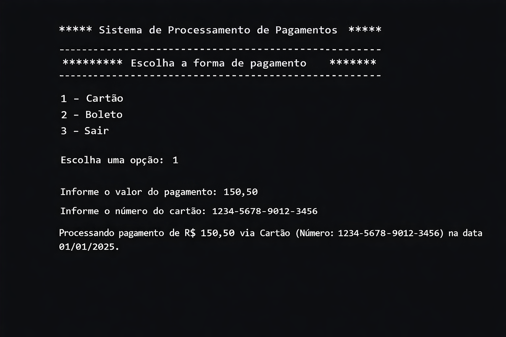
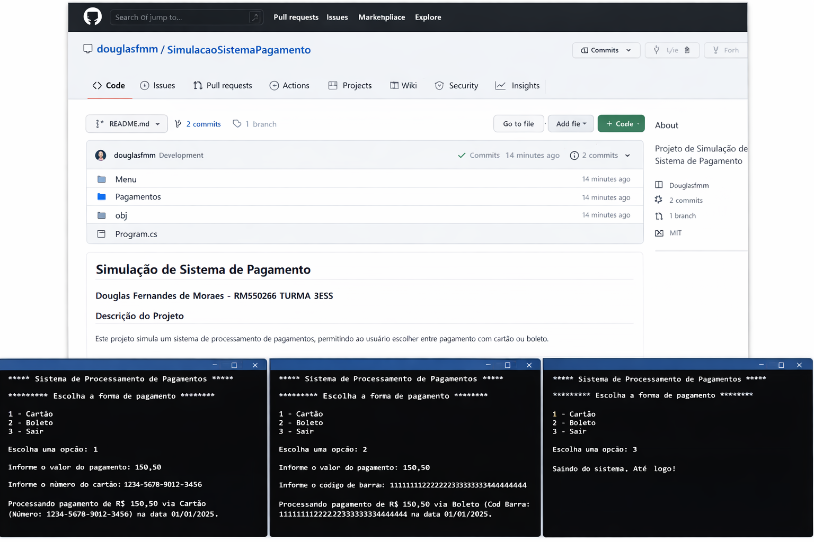

# Sistema de Processamento de Pagamentos

## Identificação

- **Aluno**: Rodrigo Leme  
- **Matrícula**: RM550266  
- **Turma**: 3ESS

## Objetivo

Este projeto consiste em uma aplicação de console em C# que simula um sistema de pagamentos simples.  
O usuário escolhe entre pagamento via **Cartão** ou **Boleto**, informa o valor e os dados necessários (número do cartão ou código de barras), e o sistema processa a operação exibindo um resumo da transação.

## Estrutura do Projeto

O código foi organizado em pastas seguindo boas práticas de programação orientada a objetos:

- `Payments/Payment.cs` – Classe base abstrata que define propriedades comuns (valor e data) e o método abstrato `ProcessPayment()`.
- `Payments/CardPayment.cs` – Implementação específica para pagamentos via cartão, contendo a propriedade `CardNumber` e sobrescrevendo `ProcessPayment()`.
- `Payments/BoletoPayment.cs` – Implementação específica para pagamentos via boleto, contendo a propriedade `Barcode` e sobrescrevendo `ProcessPayment()`.
- `Menu.cs` – Classe estática responsável por exibir o menu principal.
- `Program.cs` – Classe principal que controla o fluxo de execução, coleta dados do usuário e instancia as classes de pagamento adequadas.
- `prints/` – Pasta que contém imagens de evidência dos testes de cada operação de pagamento.

## Como Executar

Para executar a aplicação, é necessário ter o **.NET SDK** instalado. Em um terminal, navegue até a pasta `PaymentSystem` e execute:

```bash
dotnet run
```

O programa exibirá um menu com as opções de pagamento:

```
***** Sistema de Processamento de Pagamentos *****
********** Escolha a forma de pagamento **********
1 - Cartão
2 - Boleto
3 - Sair
Escolha uma opção:
```

Após escolher a forma de pagamento, o sistema solicitará o valor (aceitando diferentes formatos numéricos) e os dados específicos (número do cartão ou código de barras). O processamento exibirá uma mensagem de confirmação com o valor, a forma de pagamento, o identificador informado e a data da transação.

## Evidências de Teste

As figuras abaixo mostram a aplicação sendo utilizada para processar pagamentos com as duas formas disponíveis:

  
**Figura 1:** Exemplo de processamento de pagamento via Cartão. (** REPOS - ILUSTRATIVO **)

  
**Figura 2:** Exemplo de processamento de pagamento via Boleto.

Cada teste comprova que o sistema solicita os dados corretos, processa o pagamento e exibe o resumo no formato especificado.
